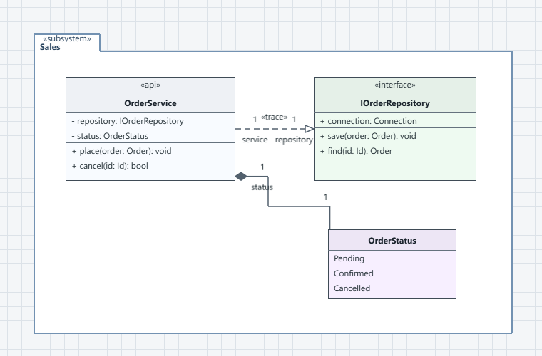

# yauml

**Yet Another UML — understand an existing C++ codebase through UML diagrams.**

Large C++ projects are difficult to overview from files and declarations alone.
`yauml` is for developers who find it easier to understand architecture
visually: import the source tree, choose the parts that matter, and arrange
them into UML views that explain the system.



## Why yauml

The project was inspired by experience with many UML tools. The most recent
influence was the [Gaphor UML editor](https://github.com/gaphor/gaphor), while
yauml follows its own source-first direction for understanding existing C++
systems.

Its main advantages are:

- **Maximum practical rendering performance.** The diagram canvas is built on
  the GPU-accelerated Qt Quick/QML scene graph and is designed to remain
  responsive with large architecture views.
- **An open model format.** Projects are ordinary directories containing
  readable JSON5 files that can be inspected, version-controlled, and processed
  without yauml.
- **Robust synchronization with source files.** Repeated imports distinguish
  source changes from manual model edits, preserve user-owned information, and
  report real conflicts instead of silently overwriting work.

## What yauml is for

- Exploring the architecture of an unfamiliar or long-lived C++ project.
- Building focused views of subsystems instead of one overwhelming diagram.
- Following dependencies, ownership, inheritance, and implementation
  relationships.
- Preparing for refactoring or discussing architecture with a team.
- Keeping explanatory UML diagrams synchronized with evolving source code.

The source model and its diagrams are separate. A type can appear on several
diagrams, each with a different layout, level of detail, filter, or visual
style.

## From source code to an architecture overview

1. Create a project and choose **File > Import C++…**.
2. Select one or more source folders. A configured build is not required.
3. Review the import preview and apply the discovered types and relationships.
4. Search or browse namespaces and nested types in the project tree.
5. Drag individual types, a multi-selection, or a complete namespace onto a
   diagram.
6. Create more diagrams for different subsystems, layers, or questions.
7. Use **Synchronize C++** later to review changes without losing manual work.

If a compilation database is available, yauml uses it automatically. Otherwise,
it discovers common C++ source and header layouts directly from the selected
folders.

## Highlights

### C++-aware model

- Classes, structs, enums, namespaces, nested types, fields, and operations.
- Inheritance, implementation, dependency, association, aggregation,
  composition, and containment relationships.
- Configurable recognition of interfaces and ownership/container types.
- Source-derived `local` and `private` stereotypes, plus project-specific
  stereotypes.
- Repeatable synchronization with an explicit preview and conflict reporting.
- Manual edits remain authoritative unless the user explicitly chooses the
  imported value.

### Productive diagram workspace

- Multiple diagrams over one shared model.
- Detachable tabbed diagram windows for multi-monitor work.
- Namespace and custom-folder containers.
- Straight and automatically maintained orthogonal connectors.
- Draggable connector ends, snap points, bend points, roles, cardinalities,
  names, and stereotypes.
- Lasso and multi-selection, alignment, distribution, matching sizes, guides,
  grid snapping, and fit-to-content.
- In-place text editing, undo/redo, contextual toolboxes, and named styles.
- Diagram filters by type, stereotype, name, field, or operation.
- One-click expansion of incoming or outgoing type dependencies.

### Local and safe

- Projects are ordinary local directories containing readable JSON5 files.
- Source import never rewrites C++ files.
- Unsaved, externally changed, and interrupted saves are handled explicitly.
- Validation and import are also available for headless workflows.
- Installed builds can check for stable updates and hand approved updates to
  the maintenance tool.

## Get yauml

Windows is the primary supported platform.

Download the installer or portable archive from
[GitHub Releases](https://github.com/uafUa/yauml/releases). The installer
contains the required Qt runtime and C++ import support.

Development builds are also available from successful
[Windows CI runs](https://github.com/uafUa/yauml/actions/workflows/windows.yml).

## Current focus

`yauml` currently concentrates on class and architecture diagrams for existing
C++ systems. It is not intended to be a complete implementation of every UML
diagram type or a code generator.

The product direction and completed feature slices are tracked in
[the productization plan](docs/productization-plan.md). Release and packaging
instructions are in [the release guide](docs/releasing.md).

## Credits

`yauml` was conceived and product-directed by [uafUa](https://github.com/uafUa).
Its code was generated and developed by OpenAI Codex in close collaboration
with the project author.

<details>
<summary>Build from source on Windows</summary>

The development build uses MSVC 2022, Qt 6, CMake, and LLVM/libclang for C++
import:

```powershell
cmake -S . -B build-release -G "Visual Studio 17 2022" -A x64 `
  -DCMAKE_PREFIX_PATH=C:/Qt/6.11.1/msvc2022_64 `
  -DYAUML_REQUIRE_LIBCLANG=ON
cmake --build build-release --config Release
ctest --test-dir build-release -C Release --output-on-failure
```

The executable is created at `build-release/Release/yauml.exe`.

</details>
